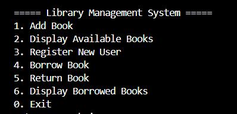
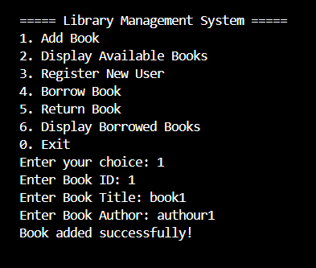
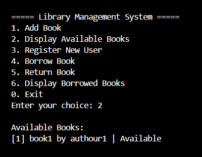
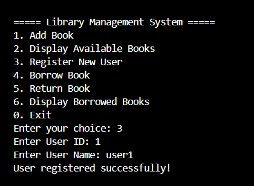
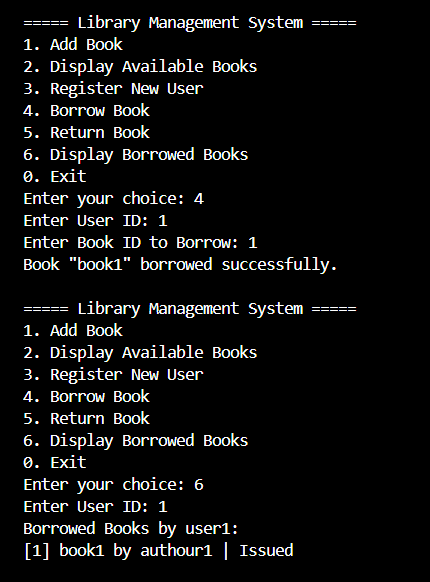
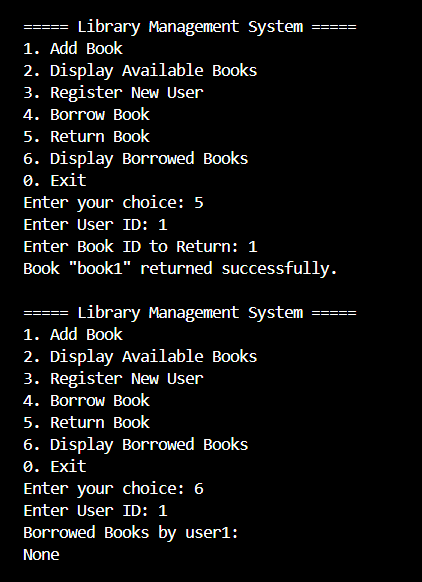
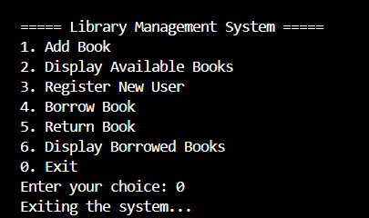

# # Library Management System (Java)

A simple command-line Java project for managing a library with features like adding books, registering users, borrowing/returning books, and displaying borrowed items.

## # Features

- Add new books to the system
- Register users
- Display all available books
- Borrow and return books
- View borrowed books per user

## # Project Structure
.
├── src/
│ ├── Main.java
│ ├── Book.java
│ ├── User.java
│ └── LibrarySystem.java
├── assets/
│ └── (screenshots here)
├── README.md
├── LICENSE
└── .gitignore


## # Technologies Used

- Java (JDK 17+)
- No external libraries
- CLI-based interface

## # Screenshots


<br>

<br>

<br>

<br>

<br>

<br>


## # How to Run

1. Clone the repository
2. Compile and run using:
   ```bash
   javac src/*.java
   java src.Main
